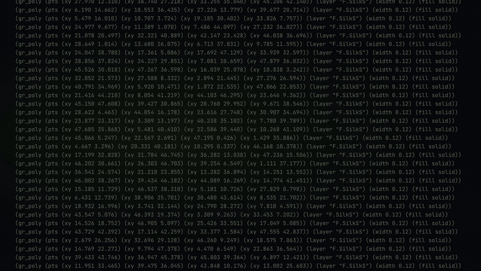

<p align="center">
  
</p>
<p align="center"><strong>From artwork to silkscreen.</strong></p>

<p align="center">
  <a href="assets/video-explain.mp4"></a>
</p>

# PCB Artwork Skill

**Turn a visual PCB reference into production-aware KiCad silkscreen artwork without asking the model to hand-draw the board.**

PCB Artwork Skill separates visual interpretation from PCB geometry. The agent reads the reference, breaks the design into primitives, and writes a compact artwork plan. Deterministic scripts handle coordinates, clipping, KiCad serialization, and validation.

```bash
npx skills add yuzushi-dev/pcb-artwork-skill
```


## How it works

```text
reference image / SVG
        │
        ▼
visual decomposition
        │
        ▼
artwork.json
        │
        ├── stencil geometry
        ├── polygons
        ├── polylines
        ├── hatching
        ├── reticles
        └── barcodes
        │
        ▼
board geometry + keepouts
        │
        ▼
clipping + clearance checks
        │
        ▼
KiCad F.SilkS / B.SilkS
        │
        ▼
Gerber + validation
```

The reference controls the composition. The board controls where ink can exist.

The compiler reads the board, expands and clips the original artwork plan, and
writes a PCB copy in one invocation. Unsupported protected geometry blocks the
operation. See [supported geometry, verification and v1 migration](docs/plans/geometry-pipeline.md).

For desired artwork `S` and protected board geometry `K`:

```text
S_safe = S - buffer(K, clearance)
```

The agent should describe the artwork in the intermediate representation instead of improvising hundreds of `gr_poly` entries inside the PCB file.

## What it handles

- KiCad PCB inspection before artwork changes
- visual-reference decomposition into reusable primitives
- millimetre-based artwork plans
- `F.SilkS` and `B.SilkS` output
- geometry-based lettering when a font would make the result machine-dependent
- repeated patterns such as hatching and barcode bars
- explicit clearance rules
- reproducible generated artwork
- validation before Gerber review

Supported board file token: `20241229`, verified on KiCad CLI 10.0.5. See the
[supported subset](references/supported-geometry.md). The default conservative profile targets 0.20 mm
silkscreen strokes and at least 0.25 mm mask/drill clearance. A post-clipping width heuristic
flags suspect details; supplier compliance is still not certified. See the
[manufacturing profile](references/manufacturing-profile.md) and
[calibration coupon](docs/calibration.md).

The electrical design stays outside the artwork pipeline. The skill does not move footprints, tracks, vias, zones, pads, nets, drills, or the board outline unless the user asks for a board change.

## Install

Install the skill straight from GitHub:

```bash
npx skills add yuzushi-dev/pcb-artwork-skill
```

The repository exposes the installable skill at `skills/pcb-artwork/`, including its scripts, schema, and references. The installer can therefore copy the complete skill instead of leaving runtime files behind at repository root.

The skill needs Python 3.11 or newer. Its geometry helpers use Shapely and JSON Schema:

```bash
python3 -m venv .venv
source .venv/bin/activate
python -m pip install "shapely>=2.1,<3" "jsonschema>=4.22,<5"
```

## Use

Inspect the board first:

```bash
python scripts/inspect_board.py board.kicad_pcb > board-geometry.json
```

Write and validate an `artwork.json` plan:

```bash
python scripts/validate_artwork.py artwork.json
```

Compile and write the PCB copy:

```bash
python scripts/compile_artwork.py \
  --board board.kicad_pcb \
  --artwork artwork.json \
  --output board-artwork.kicad_pcb \
  --report artwork-report.json \
  --review-svg review.svg
```

`clip_artwork.py` and `patch_kicad.py` are compatibility aliases for the same
operation. Both now take the **original artwork plan** and output a PCB copy.
Use `--manufacturing-profile geometry-only` to explicitly retain the previous
clearance behavior without the manufacturing audit.

There is no compiled JSON handoff or input-hash protocol. Legacy compiled JSON
with `meta` must be replaced by its original plan.

Then open the result in KiCad, run DRC, export the Gerbers, and inspect the manufactured layers rather than relying on the PCB editor preview.

## Intermediate representation

A design instruction stays small enough to inspect:

```json
{
  "version": 1,
  "layer": "F.SilkS",
  "clearance_mm": 0.16,
  "items": [
    {
      "id": "edge-hatch",
      "type": "hatching",
      "region": [2.0, 2.0, 14.0, 4.5],
      "angle_deg": 55,
      "bar_width_mm": 0.42,
      "spacing_mm": 0.68
    },
    {
      "id": "ecg",
      "type": "polyline",
      "width_mm": 0.25,
      "points": [[3, 29], [9, 29], [10, 27.1], [11, 30.0], [12, 29]]
    }
  ]
}
```

This boundary keeps visual reasoning readable and leaves repetition, clipping, and serialization to code.

Coordinates and widths use millimetres. `spacing_mm` denotes centre-to-centre
hatch pitch; `angle_deg` defaults to 0 when omitted.
See the migration note for required fields, rejected inputs and resource limits.

## Local verification

In Bash, create and activate the environment first (or reuse the one from Setup):

```bash
python3 -m venv .venv
source .venv/bin/activate
python -m pip install -r requirements-test.txt
python -m pytest -q
python scripts/verify_bundle.py
```

## Repository structure

The installable bundle lives in `skills/pcb-artwork/`: `SKILL.md`, schema,
references, scripts and the runtime `lib/` modules. Root scripts are development
entry points; schema and skill copies are checked by `scripts/verify_bundle.py`.
`tests/` covers geometry, safe patching and CLI behavior. Real KiCad exports and
rerun instructions live in [docs/verification](docs/verification/README.md).

## License

Released under the [MIT License](LICENSE). You may use, copy, modify, merge, publish, distribute, sublicense, and sell copies of the software under its terms. The copyright and license notice must remain with copies or substantial portions of the software.
